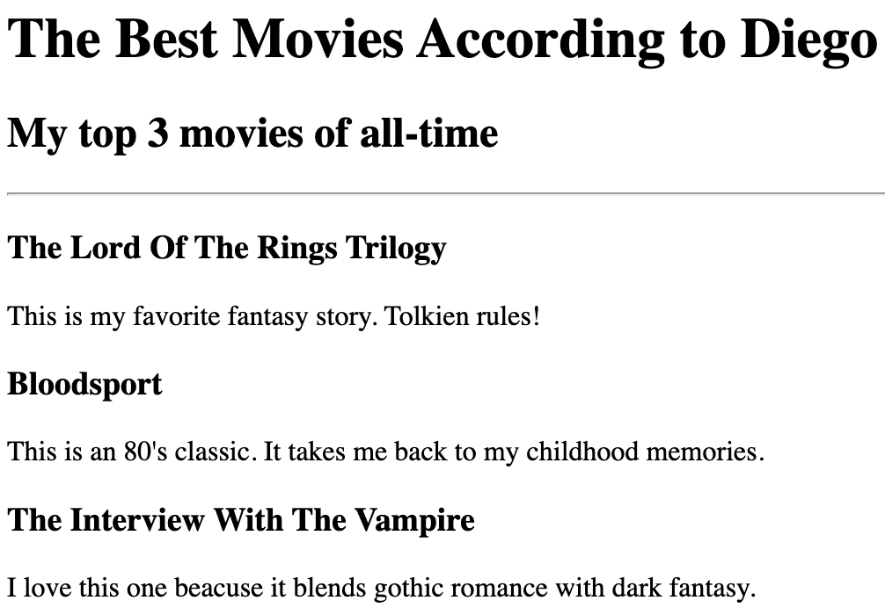
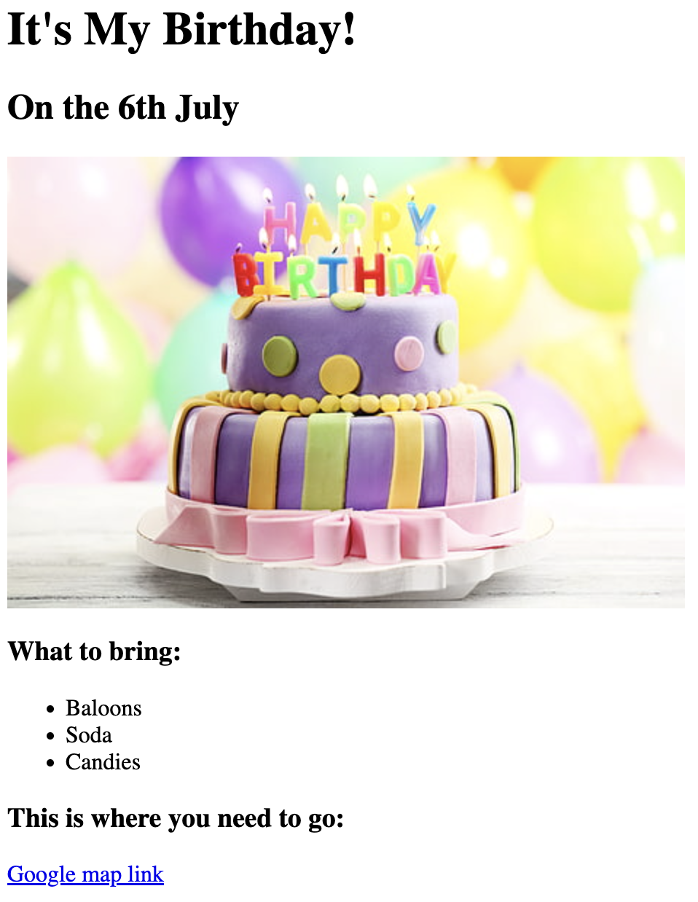

# Diego's Portfolio

This is a basic HTML portfolio project showcasing simple web development exercises.  
It includes multiple pages built with only **HTML** to demonstrate structure, linking, and basic formatting.

## 📂 Project Structure
- **index.html** → Main portfolio page with links to all projects
- **movie_ranking.html** → A project that lists favorite movies 
- **bithday_invite.html** → A birthday invitation with images and a Google Maps link
- **about_me.html** → Personal "About Me" page with an image and text
- **contact_me.html** → Contact information page

## 🖼️ Preview
- **Movie Ranking Project:** 
- **Birthday Invite Project:** 

## 🚀 How to Run
1. Clone or download this repository.  
2. Open `index.html` in any web browser.  
3. Navigate through the links to explore the projects.

## ✨ Features
- Clean and simple HTML structure.  
- Demonstrates linking between multiple pages.  
- Includes images and external links (Google Maps).  

## 📧 Contact
For any inquiries, check the [Contact Me page](./public/contact_me.html)
